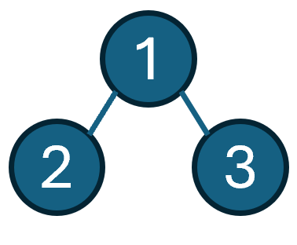
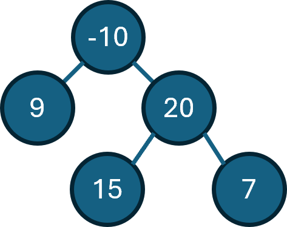

## Problem Description

Given a **non-empty binary tree**, find the **maximum path sum**. A **path** is defined as any sequence of nodes from some starting node to any node in the tree along the parent-child connections. The path must contain **at least one node** and does not need to go through the root.

---

### Example 1

```
Input: root = [1,2,3]
Output: 6
```

**Explanation:**

The maximum path sum is `2 → 1 → 3 = 6`.

**Tree Visualization:**



---

### Example 2

```
Input: root = [-10,9,20,null,null,15,7]
Output: 42
```

**Explanation:**

The maximum path sum is `15 → 20 → 7 = 42`.

**Tree Visualization:**



---

## Constraints

* The number of nodes in the tree is in the range `[1, 3 * 10^4]`.
* `-1000 <= Node.val <= 1000`

---

## Function Signature

```python
class TreeNode:
    def __init__(self, val=0, left=None, right=None):
        self.val = val
        self.left = left
        self.right = right

def maxPathSum(root: TreeNode) -> int:
    pass
```

---

### Notes

* The path **does not need to go through the root**.
* A path can **start and end at any node** in the tree.
* Think recursively about the maximum sum you can get from each subtree.
